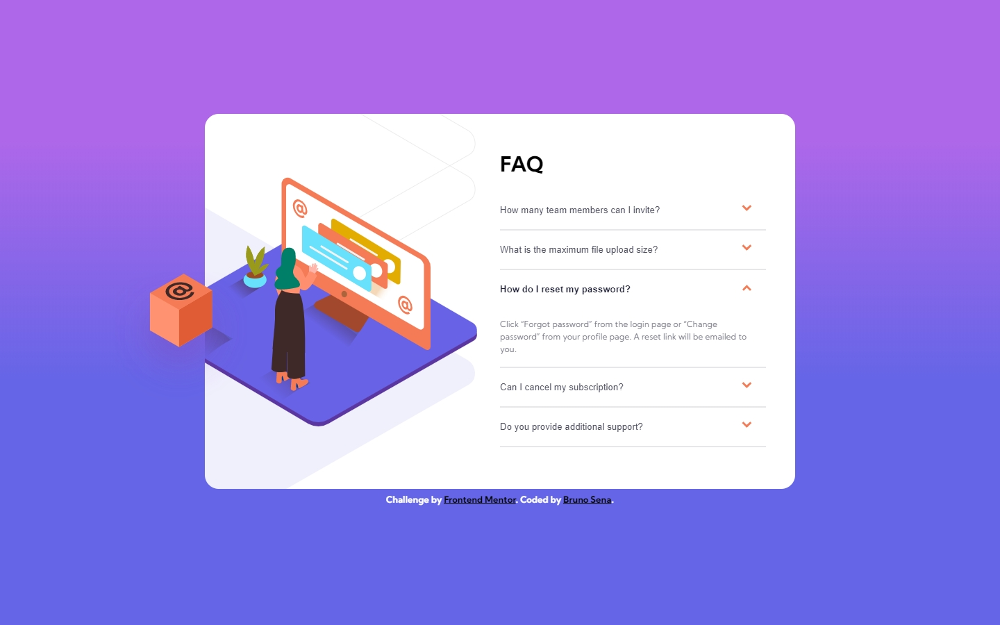

# Frontend Mentor - FAQ accordion card solution

This is a solution to the [FAQ accordion card challenge on Frontend Mentor](https://www.frontendmentor.io/challenges/faq-accordion-card-XlyjD0Oam). Frontend Mentor challenges help you improve your coding skills by building realistic projects. 

## Table of contents

- [Overview](#overview)
  - [The challenge](#the-challenge)
  - [Screenshot](#screenshot)
  - [Links](#links)
- [My process](#my-process)
  - [Built with](#built-with)
  - [What I learned](#what-i-learned)
- [Author](#author)

## Overview

### The challenge

Users should be able to:

- View the optimal layout for the component depending on their device's screen size
- See hover states for all interactive elements on the page
- Hide/Show the answer to a question when the question is clicked

### Screenshot



### Links

- Solution URL: [GitHub](https://github.com/brujavsen/faq-accordion)
- Live Site URL: [GitHub-Pages](https://brujavsen.github.io/faq-accordion/) --- [Netlify](https://faq-accordion-card-main-bruno.netlify.app/)

## My process

### Built with

- Semantic HTML5 markup
- CSS custom properties
- Flexbox
- CSS Grid
- Mobile-first workflow

### What I learned

This has certainly been an excellent challenge. I tried to use less code in JavaScript and CSS3, as at first I felt I had made it very extensive. I had forgotten the idea of creating utilities in CSS, but what attracted me the most and that for a moment I did not know, was the toggle method, since at first I was unaware of its use, but it was very useful to implement it in this challenge.

To see how you can add code snippets, see below:

```css
/* Utilities */
.text-select > input {
    color: var(--text-selected);
    font-weight: var(--bold);
}
.arrow > img {
    transform: rotate(180deg);
}
```
```js
  this.classList.toggle();
```

## Author

- Frontend Mentor - [@brujavsen](https://www.frontendmentor.io/profile/brujavsen)

Thx for read :D